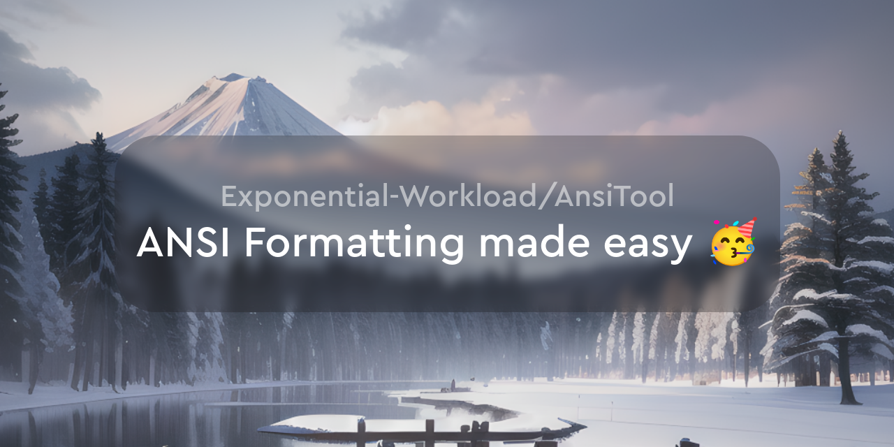

i'll make a proper readme later

# AnsiTool

A rewrite of [this](https://rebane2001.com/discord-colored-text-generator/) nice tool in svelte, with a few extra features, such as supporting non-discord ANSI formatting.

For an overview of ansi codes, see [`ansi-cheatsheet`](https://github.com/Exponential-Workload/ansi-cheatsheet) (`curl ansi.paws.ong`)

## License

AGPL-3.0-or-later
